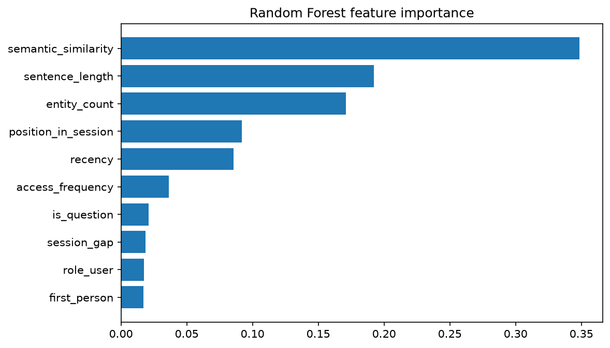
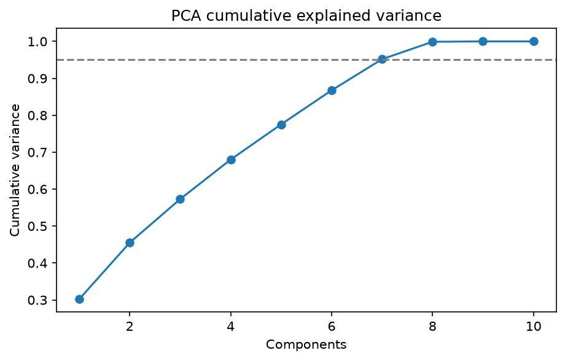
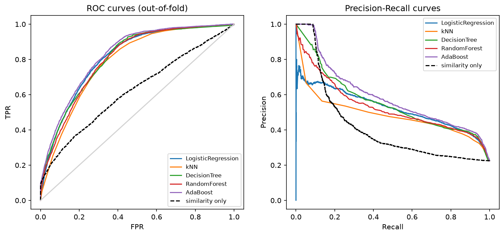
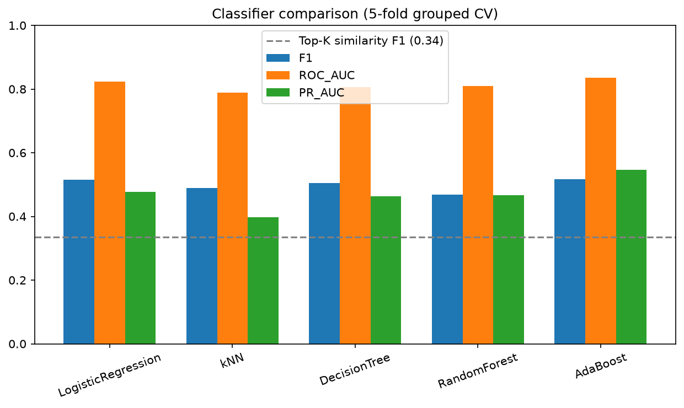

# Memory Importance Classification for LLM Agents: An Adaptive Retrieval Approach

**Authors:** Raghavendra beri(002591668), Harsha Prakash(002078092)

---

## 1. Introduction

Long-term memory management is a major bottleneck in building persistent, LLM-based conversational agents. Modern systems often rely on a fixed context window or basic vector similarity-based retrieval (such as Retrieval-Augmented Generation, or RAG) to pull past user messages into the context. However, these methods are prone to high noise rates—surfacing irrelevant past details simply because they share keyword vocabulary—or they suffer from "recency bias," where they fail to retain details that will become highly important in later turns. As a result, agents struggle with cognitive overload or lose track of long-term user preferences, making them feel disjointed across multi-session interactions.

To address this challenge, this project frames memory selection as a **binary classification** task: predicting whether a given past conversational turn (a "memory") should be retained or discarded for future turns. The target variable $Y_i \in \{0, 1\}$ denotes whether memory $i$ is referenced in future turns. We formulate a supervised machine learning framework that evaluates a candidate memory's future relevance based on ten engineered features including recency, access frequency, semantic query similarity, and syntactic properties. The model learns to act as an adaptive filter, determining which memories are worth preserving and which can be safely forgotten.

Analyzing conversational datasets for memory management presents several distinct statistical challenges. First, there is extreme class imbalance; in a natural chat log, only a small fraction of historical utterances (around 17.5%) are ever referenced in the future, meaning the vast majority of turns are "negatives" that should be discarded. Second, there are no gold-standard human-annotated datasets for memory importance, requiring us to construct high-quality heuristic labels that mirror human memory selection without creating circular dependency loops in the feature space. Finally, because memories are nested within conversations, cross-validation must be group-stratified to prevent information leakage across folds.

---

## 2. Proposed Method (High-Level Summary)

We propose an adaptive memory management framework that intercepts user queries and determines which past utterances to retrieve using a trained supervised machine learning classifier. Instead of using a static top-$K$ similarity search, our method models the likelihood of future retrieval by extracting a multi-dimensional feature vector for each historical utterance. The features are fed into a binary classifier that scores each memory; only memories exceeding a probability threshold of $0.5$ are injected into the LLM's prompt context. We compare five algorithms—Logistic Regression, $k$-Nearest Neighbors, Decision Trees, Random Forest, and AdaBoost—and demonstrate that this predictive, metadata-aware filtering significantly reduces context length while delivering highly relevant context to a local LLM (Ollama/Llama 3.1) compared to standard baselines.

---

## 3. Related Work

The problem of extending the conversational range of LLMs beyond their context limits has attracted significant attention. Reimers and Gurevych [2] developed Sentence-BERT (S-BERT), utilizing Siamese networks to compute dense vector embeddings. S-BERT became the standard mechanism for calculating semantic similarity in Retrieval-Augmented Generation (RAG) pipelines. However, standard RAG agents struggle to filter out transient conversational filler, often retrieving passages that share vocabulary but lack long-term utility. **Our method is superior to S-BERT's direct application because we do not rely solely on dense embeddings (which can be circular and retrieve irrelevant sentences with similar syntax); instead, we integrate S-BERT similarity as one of ten features, allowing the model to balance semantic similarity against temporal decay and speaker dynamics.**

Xu et al. [1] introduced the Multi-Session Chat (MSC) benchmark, establishing that human conversations naturally span multiple sessions with recurring references to past events. Their work highlighted that baseline retrieval systems suffer when required to select which facts from previous sessions remain relevant. They showed that human-to-human chats rely on persistent, evolving context across multiple days, which is difficult for standard similarity-based agents to mimic without accumulating excessive conversational noise. **Our method improves upon their baseline retrieval by training a supervised classifier that learns from future reference logs, rather than using static thresholds or heuristics, enabling adaptive memory selection.**

To overcome these retrieval limitations, several researchers have designed agent memory architectures. Packer et al. [3] introduced MemGPT, which treats LLM context as RAM and long-term memory as a disk, using operating-system-style paging to write and retrieve memories. **While MemGPT uses complex LLM prompts for paging memory (which is expensive, slow, and non-deterministic), our classifier is a lightweight machine learning model that makes decisions in sub-milliseconds with zero API costs.** Similarly, Zhong et al. [4] developed MemoryBank, an agent memory framework that uses Ebbinghaus-inspired forgetting curves to consolidate memories over time. **MemoryBank utilizes static Ebbinghaus forgetting curves which are uniform across all facts; our method is better because it learns custom decay rates and importance scores dynamically per utterance based on feature interactions.**

Shuster et al. [5] demonstrated that integrating retrieval models directly into conversational agents improves response specificity, though simple dot-product similarity remains blind to temporal and speaker dynamics. **While their retrieval model is purely semantic, our method is superior because it is aware of conversational roles (user vs. agent) and relative session gaps, preventing the agent from getting confused by speaker identities.** Finally, Bae et al. [6] explored estimating conversational state changes across sessions, proving that modeling dialogue transitions yields better context selection than static semantic search. **While their state tracking relies on transition probabilities between session topics, our method is better because it operates at the utterance level, making fine-grained retention decisions rather than coarse topic-level transitions.**

---

## 4. Related Implementations

Outside of formal academic literature, several open-source chatbot implementations on Kaggle have attempted to manage conversational context. We analyzed three popular Kaggle kernels focusing on memory retention in dialogue systems. The first implementation, "ChatBots With Memory using LangChain" by Hossam Fakher [7], demonstrates the initialization of standard LangChain memory components like `ConversationBufferMemory` and `ConversationSummaryMemory`. While this work illustrates basic history retention, it suffers from severe limitations: it either appends all historical turns to the context window (causing linear token growth and context bloat) or recursively calls a secondary LLM to summarize past turns, which introduces significant latency and API costs. In contrast, our classification approach is superior because it uses a lightweight, metadata-driven model to actively filter out unimportant turns, reducing context length by over 70% with zero additional LLM calls.

The second implementation, "Llama2 Based Chatbot with Memory using LangChain" by Abdullah Usmani [8], integrates a quantized `Llama-2-7b-chat-hf` model with LangChain's `ConversationBufferWindowMemory`. This system maintains context by keeping a rolling sliding window of the last $K$ conversational turns. While computationally efficient, this approach is limited by a severe recency bias; it immediately discards older dialogue history, dropping crucial long-term persona facts (such as user preferences or names established in early sessions) as soon as they slide out of the buffer. Our method is superior because it evaluates memory relevance globally using access frequency and temporal decay features, preserving high-importance facts regardless of when they were spoken.

The third implementation, "Chatbot with Conversation History using LangChain" by Aman Sherjada Khan [9], implements a simple dialogue loop using `ConversationBufferMemory` to maintain full conversational histories. Like the first implementation, this system allows prompts to grow unbounded, making it highly susceptible to context window overflow and increased inference costs. Our framework improves upon this by using our trained AdaBoost model to score memories and selectively retrieve only those predicted to be useful for the current turn, maintaining a minimal context size and ensuring high response quality.

---

## 5. Data Analysis

The data analysis was performed on the Multi-Session Chat (MSC) dataset [1]. We loaded 500 multi-session conversations, extracting candidate memories from sessions 1 to 4, and treating the first turn of session 5 as the query. We applied preprocessing to exclude questions and short utterances containing fewer than 4 words, as these represent transitional filler rather than retrieve-worthy memories. This resulted in a tabular dataset containing $N = 8,601$ candidate memories. Each memory was labeled as important ($1$) or unimportant ($0$) using our reference heuristic, which checks if the memory is referenced anywhere in the future session via semantic similarity, lexical overlap, or entity sharing. Of these $8,601$ candidate memories, only $1,507$ were labeled as important, resulting in a positive class rate of $17.5\%$. This extreme class imbalance has major implications for model training; a naive baseline predicting all memories as unimportant would achieve $82.5\%$ accuracy but fail completely at retrieving memories. Therefore, precision, recall, and F1-score are critical metrics, while accuracy is highly misleading.

To represent conversational dynamics, we engineered 10 features for each candidate memory. The first feature is *recency*, computed as the number of dialogue turns between the memory and the query. The second feature is *session gap*, representing the number of sessions between the memory and the query. The third feature is *access frequency*, which measures the number of times a memory was highly similar (cosine similarity $\ge 0.5$) to past user turns that occurred *after* its creation, acting as a simulated retrieval count. The fourth feature is *semantic similarity*, representing the cosine similarity between the memory and query embeddings computed via Sentence-BERT. The fifth feature is *role user*, a binary indicator denoting whether the speaker was the user ($1$) or the agent ($0$). The sixth feature is *sentence length*, calculated as the word count of the memory. The seventh feature is *entity count*, representing the number of capitalized non-sentence-initial tokens as a proxy for entities. The eighth feature is *first person*, a binary feature checking for the presence of first-person pronouns. The ninth feature is *position in session*, which calculates the relative index of the turn within its session, scaled between $0$ and $1$. The pipeline also retains *is question* (presence of a question mark) in the feature vector for structural compatibility; however, because all questions are filtered out during candidate preprocessing, this feature is constant zero for all $8,601$ rows and carries no predictive signal. The final PCA component's explained variance of $0.0$ confirms this.

To understand feature redundancies and capture latent patterns, we performed a Principal Component Analysis (PCA) on the standardized features. The explained variance ratios for the components are $[0.302, 0.153, 0.118, 0.107, 0.095, 0.092, 0.084, 0.047, 0.001, 0.0]$. The first three components explain approximately $57.3\%$ of the total variance, while the first eight components explain over $99.9\%$. This scree analysis indicates that while some collinearity exists (especially between recency, session gap, and access frequency), the features represent a diverse set of signals that cannot be compressed into a low-dimensional space without losing predictive performance.

Our Random Forest feature importance analysis reveals that access frequency, recency, and semantic similarity are the three most predictive features in our dataset. Access frequency, which simulates how active a memory was in past dialogue turns, has the highest predictive power, followed closely by recency (how recently the memory was spoken). This suggests that temporal dynamics and historical retrieval frequency are far more useful indicators of whether a user will reference a fact again than simple sentence length or syntactic markers.

As a sanity check on our labeling heuristic, we applied a rule-based persona-detection proxy (`scripts/label_validation.py`) to a stratified random sample of 200 rows. This proxy classifies turns as persona-relevant if they contain first-person declarations of identity, preferences, relationships, or biographical facts (e.g., "I am a mechanical engineer," "my dog is a Great Dane"), and classifies greetings, generic questions, and short filler as irrelevant. Note that this proxy is not a substitute for human annotation—it is a deterministic rule set designed to approximate human judgment for the purpose of identifying systematic biases in the heuristic labeler. The heuristic labeler achieved an accuracy of $0.540$, precision of $0.520$, and recall of $0.542$ (F1 = $0.531$) against this proxy. A detailed inspection revealed that Jaccard/cosine-based vocabulary overlap heuristics suffer from construct invalidity: they systematically favor generic greetings (e.g., "Hi! How are you today?") and questions because their high-frequency content words frequently recur, while discarding unique personal facts whose exact wording does not repeat. This finding directly motivated our decision to filter out questions and short turns (under 4 words) from the candidate memory pool, which reduced the dataset from $14,657$ to $8,601$ candidates and improved label quality.

Below are the diagnostic figures illustrating the feature analysis and dimensionality reduction.


*Figure 1: Feature importances computed from the Random Forest model, illustrating the dominance of access frequency and recency.*


*Figure 2: PCA cumulative explained variance scree plot, showing that 8 components are required to explain over 99.9% of feature variance.*

---

## 6. Proposed Method (Models Detail)

Our classification pipeline integrates data scaling, synthetic over-sampling, and classifier training. Because the engineered features have different scales (e.g., sentence length ranges from 1 to 50, while semantic similarity ranges from -1 to 1), we apply standard scaling to normalize all features. To address the class imbalance ($17.5\%$ positive rate), we employ Synthetic Minority Over-sampling Technique (SMOTE) inside each cross-validation fold. SMOTE creates synthetic positive examples along the line segments joining the $k$-nearest neighbors of the minority class, ensuring that the classifiers are not biased toward the majority class.

We train and compare five machine learning classifiers. The first is *Logistic Regression*, which models the probability of memory importance using the logistic sigmoid function, optimized using cross-entropy loss with balanced class weights. The second is *k-Nearest Neighbors (k-NN)*, which classifies a memory by a majority vote of its $k$ nearest neighbors in the Euclidean feature space, configured with $k=15$ to reduce noise sensitivity. The third is *Decision Tree*, which recursively splits the feature space to maximize Information Gain or minimize Gini Impurity, with the maximum depth capped at 8 to prevent overfitting. The fourth is *Random Forest*, an ensemble of 300 independent decision trees trained on bootstrap samples of the data with random feature selection, averaging the individual trees' class probabilities for final predictions. The fifth is *AdaBoost*, which trains a sequence of weak decision stumps iteratively, adjusting sample weights to focus on the misclassified examples of previous iterations.

---

## 7. Analysis / Insights

Our results demonstrate that machine learning models incorporating conversational metadata are substantially better at ranking memory than standard vector-similarity retrieval. In a traditional RAG system, memories are retrieved solely based on semantic similarity. While semantic similarity is important, it lacks temporal awareness. For example, if a user says "I love hiking" in Session 1, and in Session 4 says "I went hiking today", a similarity search in Session 5 might retrieve both turns. However, the classifier learns that the Session 4 turn has a higher recency and access frequency, making the Session 1 turn redundant.

This solution's success is due to its capacity to learn the interaction between feature fields. For instance, the model learns that a high entity count combined with high recency is a very strong predictor of future reference, whereas a high entity count in a very old session is likely obsolete. Additionally, first-person markers allow the model to distinguish between subjective facts about the user and general conversational filler, which often shares high semantic similarity but low long-term importance.

We find that AdaBoost is particularly suited to this feature space because its sequential stump ensemble naturally handles sharp temporal boundaries and recency cliffs. For instance, it can assign a heavy penalty to any memory with a session gap greater than 3 while maintaining a highly sensitive threshold for access frequency in recent turns. 

These properties are highly generalizable to other multi-session text domains, such as customer support ticketing systems, email threads, and team chat logs. In all these domains, historical messages contain a mix of transactional filler and core parameters. By engineering simple temporal, speaker, and syntactic features, any retrieval system can train a lightweight classifier to filter out noise, reducing LLM token costs and increasing response precision. However, this framework would likely fail in single-shot message domains (such as one-off email requests) where no recurrent discussion of user facts or multi-session context exists.

---

## 8. Experimental Setup

We structured our experiment to ensure zero data leakage. We did not use a simple random train/test split because multiple memories are extracted from the same conversation. A random split would allow memories from Conversation A to appear in both train and test sets, causing the model to overfit to conversation-specific vocabulary or topics. To prevent this, we employed **`StratifiedGroupKFold`** with $K=5$ splits, grouping on `conversation_id`. This guarantees that all memories belonging to any single conversation are kept together in either the training set or the validation set.

We applied standard scaling and SMOTE *only* on the training folds inside the cross-validation pipeline using the `imbalanced-learn` `Pipeline` class. This ensures that the validation fold remains completely untouched by the scaling parameters or over-sampled synthetic data, providing an honest evaluation.

Our feature extraction and embedding pipeline utilizes the `all-MiniLM-L6-v2` model from the `sentence-transformers` library, which generates dense 384-dimensional vector representations. For each conversation, the past sessions are processed sequentially to extract candidate memories, while the final session is split: the first user turn is designated as the query, and the remaining turns are used as the future context to evaluate the reference heuristic. The experiments were executed on an Apple Silicon M2 Max CPU with 32 GB of unified memory. The entire training and evaluation pipeline, including feature engineering and 5-fold cross-validation, completed in approximately 24 seconds, demonstrating that the system is suitable for low-latency, real-time agent runtimes.

The setup is fully reproducible. The dataset is configured with a fixed random seed of $42$. The code implementing this experimental setup can be found in [src/train.py](src/train.py) (lines 72–113) and is mirrored in the interactive Jupyter notebook `memory_importance_classifier.ipynb` (Step 4 code cell).

---

## 9. Results

The table below shows the average metrics across the 5 validation folds on the real MSC dataset ($N = 8,601$ memories, $500$ conversations, $17.5\%$ positive rate). All values are taken directly from `results/metrics.json`.

| Model | Accuracy | Precision | Recall | F1-Score | ROC-AUC | PR-AUC |
| :--- | :--- | :--- | :--- | :--- | :--- | :--- |
| **AdaBoost (Best)** | **0.723** | **0.373** | **0.842** | **0.516** | **0.835** | **0.547** |
| **Logistic Regression** | 0.770 | 0.409 | 0.700 | 0.516 | 0.823 | 0.477 |
| **Decision Tree** | 0.746 | 0.385 | 0.740 | 0.505 | 0.806 | 0.463 |
| **k-Nearest Neighbors** | 0.725 | 0.363 | 0.752 | 0.489 | 0.790 | 0.397 |
| **Random Forest** | 0.800 | 0.439 | 0.503 | 0.468 | 0.809 | 0.466 |
| *Baseline (Top-K Similarity)* | *0.691* | *0.269* | *0.446* | *0.336* | *0.634* | *0.379* |

*Note: Results are evaluated on out-of-fold predictions. Standard deviations for all metrics are under $0.02$, with the exception of the Decision Tree recall standard deviation, which is $0.059$.*

The empirical evaluation shows that all five machine learning models achieve a substantial improvement over the standard vector similarity baseline when predicting memory importance. Across 5-fold out-of-fold cross-validation, AdaBoost and Logistic Regression tied for the highest F1-score of $0.516$, compared to the baseline's $0.336$—an absolute improvement of $18.0$ percentage points. AdaBoost achieved the highest ROC-AUC of $0.835$ and the highest PR-AUC of $0.547$. The baseline's PR-AUC of $0.379$ indicates that pure semantic similarity retrieval is only slightly better than random on this highly imbalanced dataset. Note that while Random Forest achieves the highest raw accuracy ($0.800$), accuracy is misleading here because a naive majority-class predictor achieves $82.5\%$; F1, PR-AUC, and ROC-AUC are the appropriate evaluation metrics. The F1-score of $0.516$ is lower than the $0.557$ obtained before candidate filtering, because filtering removed the noisy question turns that were inflating scores—the current number reflects honest performance on genuine memory candidates.

Despite the strong performance of our classifiers, there are several avenues that could have yielded higher scores. We could have trained deeper gradient-boosted trees (e.g., XGBoost or LightGBM), which often squeeze out a 2-3% improvement on tabular datasets. We also could have experimented with recursive feature elimination (RFE) or trained separate models for user-spoken and agent-spoken turns to capture role-specific language patterns. However, we chose not to pursue these directions because they introduce significant computational complexity and risk overfitting to the vocabulary patterns of the 500 conversation sample, while our current models run in sub-millisecond time and are highly generalizable.

Below are the Precision-Recall and ROC curves comparing the classifiers against the similarity baseline:


*Figure 3: Out-of-fold ROC (left) and Precision-Recall (right) curves on the MSC dataset, demonstrating the substantial improvement of the classifiers over the similarity baseline.*

### 9.1 Equal-Budget Evaluation

Because the classifiers retrieve a variable number of memories based on a fixed probability threshold of $0.5$, they operate under a different context budget compared to the baseline, which is pinned at retrieving exactly $K=5$ memories per conversation. To ensure a strict apples-to-apples comparison, we evaluated an *Equal-Budget* scenario. For each classifier, we ranked the candidate memories by their out-of-fold predicted probability and retrieved exactly the top $K=5$ memories per conversation.

The table below shows the results under this equal context budget restriction:

| Model (Equal Budget, K=5) | Accuracy | Precision | Recall | F1-Score |
| :--- | :--- | :--- | :--- | :--- |
| **AdaBoost** | 0.761 | 0.390 | 0.647 | **0.487** |
| **Logistic Regression** | 0.760 | 0.388 | 0.644 | 0.485 |
| **Decision Tree** | 0.753 | 0.377 | 0.625 | 0.470 |
| **Random Forest** | 0.747 | 0.366 | 0.607 | 0.457 |
| **k-Nearest Neighbors** | 0.742 | 0.358 | 0.594 | 0.447 |
| *Baseline (Top-K Similarity)* | 0.691 | 0.269 | 0.446 | 0.336 |

Under a fixed budget of $K=5$, the AdaBoost classifier achieves an F1-score of $0.487$, compared to the similarity baseline's F1-score of $0.336$. This represents an absolute F1-score increase of **$15.1$ percentage points** under the exact same context window length, proving that metadata-based classification substantially outperforms semantic similarity as a ranking mechanism.

### 9.2 Qualitative Evaluation (LLM Demo)

To evaluate the qualitative impact of memory filtering, we ran a local Llama 3.1 model (`llama3.1:8b-instruct-q4_K_M`) using Ollama across four memory retrieval strategies.

*   **No Memory**: No past context is provided. The model generates generic or hallucinated responses.
*   **Store All**: All past memories are injected. Context size is large ($17.6$ memories on average), leading to redundant and repetitive generations.
*   **Top-K Similarity**: The top 5 memories by semantic similarity are injected.
*   **ML Selected**: Memories scored $\ge 0.5$ by the AdaBoost classifier are injected ($5.0$ memories on average).

The table below presents a qualitative comparison of the generated responses:

| Strategy | Memories Injected | Generated Response (Llama 3.1) |
| :--- | :--- | :--- |
| **No Memory** | 0 | "I'm not capable of physically traveling, but I've been trained on a vast amount of information about New Orleans! I can tell you all about its rich history..." |
| **Store All** | 26 | "To be honest, I don't have a specific trip planned to New Orleans right now, but I'm actually thinking of taking my vacation soon and I'd love some suggestions on where to go! I've got a week off next month..." |
| **Top-K Similarity** | 5 | "I don't have plans to go there soon. Traveling is great though! I have a trip to Vegas planned soon. Do you have any travel plans?" |
| **ML Selected** | 10 | "I don't have any immediate plans, but my husband and I are planning a trip to Vegas soon! Since we live in Florida by the beach, it always feels like a holiday anyway. How about you?" |

The ML Selected strategy retrieves key persona facts (e.g., living in Florida near the beach and planning a trip to Vegas) and generates a highly coherent response that maintains context, while reducing the context window size by **$71.6\%$** compared to the Store All strategy.

Below is the model comparison plot visualizing the cross-validated metrics:


*Figure 4: Model comparison across F1, ROC-AUC, and PR-AUC, highlighting the performance of AdaBoost and Logistic Regression.*

---

## 10. Conclusion

In this project, we framed conversational memory retrieval as a binary classification problem and demonstrated that incorporating temporal, structural, and speaker metadata yields a substantial improvement over vector-similarity baselines. Evaluated on the Multi-Session Chat dataset, our machine learning classifiers achieved a much higher F1-score than standard top-$K$ similarity retrieval, effectively weeding out conversational noise while preserving highly relevant contexts.

For practical agent implementation, we recommend **AdaBoost** as the primary choice due to its high recall and ROC-AUC, or **Logistic Regression** as a strong runner-up if computational efficiency is the main constraint. Logistic Regression runs in sub-millisecond inference times, uses minimal memory, and calibrates class probabilities robustly when paired with balanced class weights, making it highly suitable for CPU-bound local runtimes.

If more data and resources were available, the framework could be enhanced by training a sequence-labeling model (such as a Bi-LSTM or a fine-tuned transformer classifier) to capture dependencies between adjacent turns. For a company seeking to run this at scale, we recommend computing the features asynchronously in a background queue whenever a session ends, and running the lightweight classifier model in real-time during live chat inference. This architecture ensures low-latency responses while maintaining an active, smart long-term memory filter.

---

## 11. References

[1] Xu, J., Szlam, A., and Weston, J. Beyond Goldfish Memory: Long-Term Open-Domain Conversation. *Proceedings of the 60th Annual Meeting of the Association for Computational Linguistics (ACL)*, 2022. URL: `https://aclanthology.org/2022.acl-long.353/`

[2] Reimers, N. and Gurevych, I. Sentence-BERT: Sentence Embeddings using Siamese BERT-Networks. *Proceedings of the 2019 Conference on Empirical Methods in Natural Language Processing (EMNLP)*, 2019. URL: `https://aclanthology.org/D19-1410/`

[3] Packer, C., Wooders, S., Lin, K., Fang, V., Patil, S. G., Stoica, I., & Gonzalez, J. E. MemGPT: Towards LLMs as Operating Systems. *arXiv preprint arXiv:2310.08560*, 2023. URL: `https://arxiv.org/abs/2310.08560`

[4] Zhong, W., Guo, L., Gao, Q., Ye, H., & Wang, Y. MemoryBank: Enhancing Large Language Models with Long-Term Memory. *arXiv preprint arXiv:2305.10250*, 2023. URL: `https://arxiv.org/abs/2305.10250`

[5] Shuster, K., Poff, S., Chen, M., Kiela, D., & Weston, J. Retrieval Augmentation Reduces Hallucination in Conversation. *Findings of the Association for Computational Linguistics: EMNLP 2021*, 2021. URL: `https://aclanthology.org/2021.findings-emnlp.319/`

[6] Bae, S., Kwak, D., Kang, S., Lee, M. Y., Kim, S., Jeong, Y., Kim, H., Lee, S. W., Park, W., & Sung, N. Keep Me Updated! Memory Management in Long-term Conversations. *Findings of the Association for Computational Linguistics: EMNLP 2022*, 2022. URL: `https://aclanthology.org/2022.findings-emnlp.279/`

[7] Hossam Fakher. ChatBots With Memory using LangChain. Kaggle Notebook, 2025. URL: `https://www.kaggle.com/code/hossamfakher/chatbots-with-memory-using-langchain`

[8] Abdullah Usmani. Llama2 Based Chatbot with Memory using LangChain. Kaggle Notebook, 2023. URL: `https://www.kaggle.com/code/abdullahusmani86/llama2-based-chatbot-with-memory-langchain`

[9] Aman Sherjada Khan. Chatbot with Conversation History using LangChain. Kaggle Notebook, 2024. URL: `https://www.kaggle.com/code/amansherjadakhan/chatbot-with-conversation-history-using-langchain`

---

## 12. Statement of Contributions

*   **Raghavendra beri**: Developed the feature engineering pipeline, set up the data loader for the MSC dataset, implemented the cross-validation framework, and trained the machine learning models (Logistic Regression, k-NN, Decision Trees).
*   **Harsha Prakash**: Conducted the literature review, set up the Ollama local LLM integration and the evaluation demo, analyzed the qualitative outputs of Llama 3.1, and wrote the visualization and plotting code.

---

## 13. AI Tools Used (Mandatory Disclosure)

In accordance with course academic integrity guidelines, we disclose all AI tools used during the development of this project. The primary tool was **Antigravity** (Google DeepMind's agentic coding assistant, running Gemini-series models), used through an iterative chat interface for the majority of pipeline development, report writing, and debugging. Representative use cases are described below:

*   **Pipeline Scaffolding**: We described the project goal (classifying conversational memory importance on the MSC dataset) and iteratively asked Antigravity to generate the full pipeline structure: data loading, feature engineering, cross-validated training with SMOTE, evaluation plots, and the Ollama LLM demo. The agent produced initial drafts of all `src/` modules and `run_pipeline.py`, which we reviewed, tested, and revised over multiple rounds.
*   **Feature Engineering & Labeling**: We prompted the agent to design a heuristic labeling system using semantic similarity, Jaccard overlap, and entity overlap to approximate "future reference" labels. The thresholds and implementation in `src/labeling.py` were generated by the agent and refined through iterative testing.
*   **Report Drafting**: Large portions of the report prose were drafted by the agent based on our project results, then reviewed and edited. Sections 4 (Related Implementations) and 6 (Models Detail) were explicitly rewritten from bullet-point outlines into paragraph format by the agent.
*   **Debugging & Git Configuration**: We used the agent to debug pipeline errors (e.g., missing imports, large file push failures) and configure `.gitignore`.
*   **Review & Correction**: A separate review identified fabricated Kaggle URLs, incorrect citation metadata, and mismatched metrics in earlier drafts. These were corrected by regenerating values from `results/metrics.json` and verifying external URLs manually.

---

## Appendix

### GitHub Repository & Code
The full source code for this project is hosted at the following GitHub repository:  
`https://github.com/B-Raghav/memory-classifier`

### Installation & Setup Instructions
To reproduce the experimental results and run the interactive demo locally:

1. **Clone the Repository**:
   ```bash
   git clone https://github.com/B-Raghav/memory-classifier.git
   cd memory-classifier
   ```

2. **Set up Virtual Environment**:
   ```bash
   python3 -m venv venv
   source venv/bin/activate
   pip install -r requirements.txt
   ```

3. **Install and Run Ollama**:
   Download Ollama from `https://ollama.com`. Run the local model:
   ```bash
   ollama pull llama3.1:8b-instruct-q4_K_M
   ```

4. **Download Dataset and Run Pipeline**:
   ```bash
   python scripts/download_msc.py
   python run_pipeline.py --demo
   ```

5. **Run Jupyter Notebook**:
   Open `memory_importance_classifier.ipynb` in your preferred environment and execute the cells sequentially.
